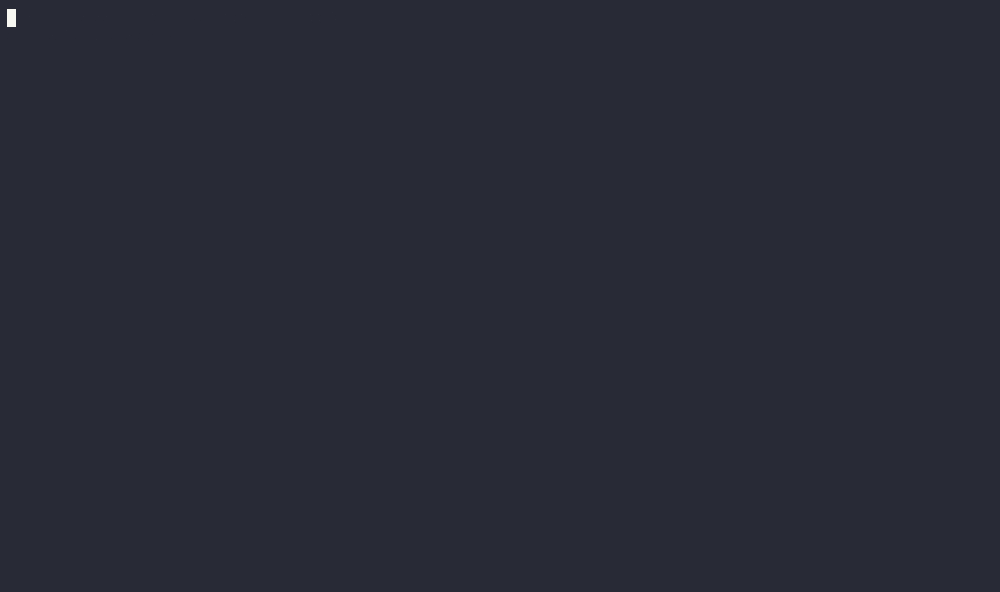

# XGS Tanker Skript 🛳️

 
 

RAUSYS Sophos XGS pre-configuration script via REST API or import-export upload. 
Defines well-known services, backup configuration and other best-practices 
(see [Configuration Overview](#configuration-overview) for details)  

Bringing all the default configuration the Sophos team missed to your XGS – aka config-tanking it. 🚀

### Ensure the cookiecutter (this repository) is compatible with the major release version of your XGS firewall 🚨

## Features ⭐️
  
⭐️ Administration configuration + CA certificate generation   
⭐️ Interface + Zone definitions  
⭐️ Definition of well-known services + networks + FQDNs  
⭐️ DNS request-based routing + authentication services  
⭐️ DHCP server or relay configuration  
⭐️ Basic Firewall rule configuration  
⭐️ Basic webfilter configuration  
⭐️ NTP service simulation (feature-parity to SG UTM)  
⭐️ Automatic XGS backup configuration  
⭐️ Delete unnecessary configuration defaults (Wireless Protection + default Firewall Policies)

## Getting Started 👾

1. Run and finalize the XGS first setup wizard + connect to the management port 
2. Ensure your client's local IP address is whitelisted for XGS API access (*SYSTEM → Backup & firmware → API*)
3. Download and install [Python 3](https://www.python.org/downloads/)
4. Install `cookiecutter` library (`pip3 install cookiecutter`)
5. Run `cookiecutter git+https://github.com/alfonsrv/sophos-xgs-cookiecutter` – ALTERNATIVELY: Download this repro and run `cookiecutter sophos-xgs-cookiecutter-main.zip`
6. Follow the prompts to configure and tank up your XGS 💥

---

The scripts prompts whether it should run automatically after cookiecutter template-generation. 
Should you choose *No*, running the script manually afterward is easy.

1. Navigate to the cookiecutter-generated directory (`xgs-tanker-api`)
2. Open a shell (`cmd`/`bash`) in the directory
3. Run `pip3 install -r requirements.txt`
4. Execute the XGS tanker script by running `python3 main.py`

Turn on debug logging (see request and response payloads) by setting `settings.LOG_LEVEL` to `logging.DEBUG` 

## API Overview 🔦

Please consider the [Sophos API specs](https://doc.sophos.com/nsg/sophos-firewall/20.0/API/index.html)  

The API can be triggered via either REST or the built-in Import-Export upload functionality. 
Note: for the latter the expected `.tar` file has to be created with the following command 
`tar -cvf xgs-tanker.tar Entities.xml` – the name `Entities.xml` is imperative.
To generate the `Entities.xml`, run `python3 main.py --entities` in the cookiecutter-generated directory.

The running XGS configuration can be exported via **SYSTEM → Backup & firmware → Import-export**; 
the XML in `Entities.xml` can be used as a further reference to discover further functionalities and 
other configuration potentials.  

**REST API**

* 👍 Fine-granular tracking and overview on single action-basis  
* 👍 Simple, streamlined user experience with proper UI  
* 👍 Allows for condition-based deletion, depending on current XGS configuration  
* 👎 Extra setup overhead (Python module `requests` + XGS API Permissions configuration)  

**Import-Export**

* 👍 Allows uploading static content such as logos, certificates, ... alongside configuration  
* 👍 Does not require Python to execute – beyond the initial `cookiecutter` generation  
* 👍 Can be triggered using a single file, making it more portable  
* 👍 Generally easier to understand concept-wise  
* 👎 Less transparent tracking of success / failure on single action-basis  
* 👎 While recommended by Sophos for a big change volume, the XGS can be left in inconsistent state if a single action fails  

## Configuration Overview

Each configuration is applied in a logical set using XML files (folder `definitions`), essentially containing the payload sent to the XGS. 
The payloads are divided by `transactionid` to make easy distinction of success / failure possible on a single-action basis.

Reference what the XGS tanker script configures:

| XML file                          | Actions executed                                                                                                                         |
|-----------------------------------|------------------------------------------------------------------------------------------------------------------------------------------|
| `01-certificates`                 | Regenerates Certificate Authority + ApplianceCertificate with better encryption standards                                                | 
| `02-admin-basic`                  | Configures Ports (WebAdmin, UserPortal, VPNPortal), Password Complexity requirements, XGS config e-mail backups, notifications, timezone |
| `03-zones`                        | Creates sensible default Zones + defines base ACLs for services                                                                          |
| `04-definitions-services`         | Well-known ports and services and service groups                                                                                         |
| `05-definitions-private-networks` | Configures Class A, Class B, Class C network scopes                                                                                      |
| `06-definitions-countries`        | "Safe Countries" in case of country-filtering requirements                                                                               |
| `08-definitions-dns`              | Cloudflare + Google DNS and XGS forward lookup configuration                                                                             |
| `09-definitions-client-dynamic`   | Customer-specific configuration (AD DS auth server, domain controller, DNS request route)                                                |
| `12-admin-management`             | Firewall ACL skips via Management port + RAUSYS WAN                                                                                      |
| `13-intrusion-prevention`         | Enable Intrusion Prevention Basics + better packets default values, while keeping flood detection disabled                               |
| `15-ntp-service`                  | NTP service for clients to simulate SG functionality (NAT, Firewall Policy, IPS policy)                                                  |
| `16-definitions-expurgate`        | eXpurgate networks definitions                                                                                                           |
| `17-definitions-exchange`         | Microsoft Exchange networks definitions                                                                                                  |
| `18-definitions-teams`            | Microsoft Teams networks + services definitions                                                                                          |
| `19-webfilter-basic`              | Webfilter configuration (content scanning, block unknown certificates, max scan size, block unscannable content)                         |
| `20-webfilter-exceptions`         | Exceptions to not be processed by the webfilter, allowing for full functionality for subservices (e.g. Entra ID Connect hosts)           |
| `21-webfilter-policy`             | RAUSYS Workplace definition + definition to only allow required OS + application updates                                                 |
| `22-firewall-management`          | Firewall Policy for Management network communications                                                                                    |
| `23-firewall-domain-controllers`  | Firewall Policy for Domain Controller (AD DS) communications + accessibility                                                             |
| `24-firewall-printserver`         | Firewall Policy for print server communications (client to server + server to printers)                                                  |
| `25-firewall-surfing`             | Firewall Policy for webfilter configuration (defined in `21-webfilter-policy`)                                                           |
| `26-firewall-groups`              | Assign Firewall Policies to groups                                                                                                       |
| `90-interfaces`                   | Interface WAN Failover + lag1 Active-Backup configuration for LAN                                                                        |
| `91-dhcp-server`                  | DHCP server configuration or DHCP relay to Domain Controllers for VLAN1                                                                  |
| `99-backup-now`                   | Create instant backup via previously configured e-mail                                                                                   |

## Limitations

* Only a single network can be defined using the XGS tanker script. Additional VLANs + network scopes have to be configured manually.
* Firewall rules + service definitions cannot be en-/disabled conditionally (e.g. if a client does not have Entra ID Connect) 
– see [GitHub PR #1645](https://github.com/cookiecutter/cookiecutter/pull/1645)

